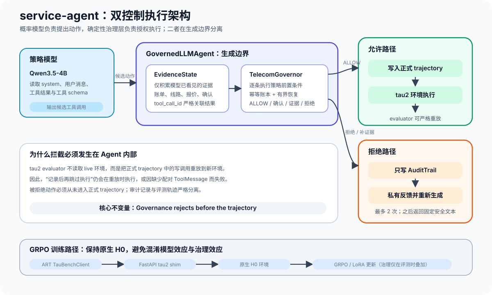
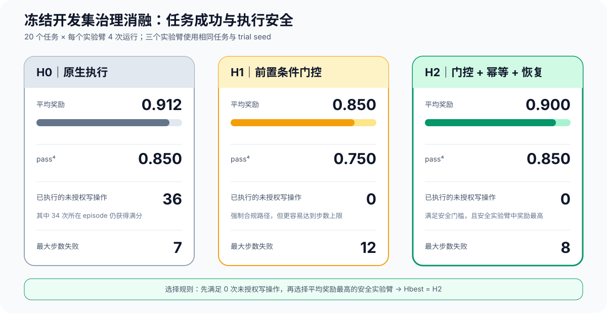
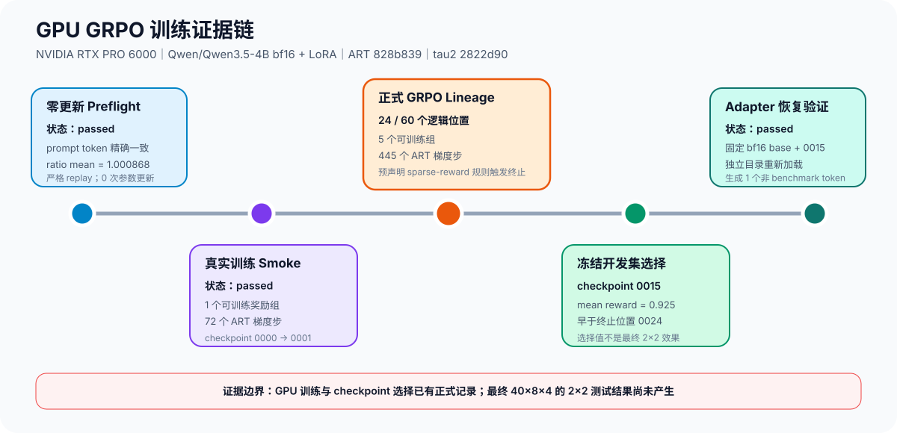

# service-agent

> [项目展示与实验声明](声明.md)

LLM Agent 发出的工具调用只是“执行意图”，并不等于“执行授权”。本项目在
tau2-bench 的电信客服领域中具体实现了这一划分：通过确定性的执行治理层判断模型提出
的写操作是否可以真正执行，并使用 2×2 实验区分 Agent 可靠性有多少来自治理框架，
有多少来自模型的 RL 后训练。

tau2-bench 的电信写工具会直接执行收到的请求：`send_payment_request` 不检查账单是否
已经支付，`refuel_data` 的号码激活状态检查也被注释掉了；但业务策略明确要求 Agent
在执行前满足这些前置条件。即使模型能力较强，仍会违反这些条件，而任务奖励不一定能
发现问题：在 dev 集上，基础模型执行了 **36 次违反策略的写操作，其中 34 次所在的
episode 仍获得满分奖励。** 这说明只看任务奖励，会把一个多次违反策略的模型判为成功。
本项目要解决的正是这一缺口。



## 核心论点

下面的结论都可以从固定版本的上游代码中复核
（`third_party/tau2-bench`，上游基线 `cf71a80`）：

```bash
# 写工具本身没有执行这些策略检查
grep -n "does not check\|Always check" \
  third_party/tau2-bench/src/tau2/domains/telecom/tools.py
grep -n "Line must be active to refuel" \
  third_party/tau2-bench/src/tau2/domains/telecom/tools.py   # 该检查已被注释

# 业务策略把这些检查责任交给 Agent
grep -n "will not check\|not allowed to lift\|maximum amount\|one tool call" \
  third_party/tau2-bench/data/tau2/domains/telecom/main_policy.md
```

`UPSTREAM.md` 按文件和行号列出了所有上游证据。治理层在代码中关闭了这个缺口：每个候选
写操作在真正执行前，都要根据对话中已经出现的证据进行检查，例如读到的客户信息、账单
状态、Agent 报出的价格，以及用户随后给出的确认。规则逐行来自业务策略
（`src/service_agent/governance/telecom_rules.py`），不会读取任务答案。

## 2×2 实验设计

本项目研究的不是“Agent 能不能完成电信客服任务”，而是：**当可靠性提高时，改进究竟
来自执行治理框架，还是来自模型后训练？** 2×2 因子实验用于回答这个问题。

| | 原生执行框架 | 治理执行框架 |
|---|---|---|
| **基础模型** | H0 | Hbest |
| **RL 模型** | RL | Hbest + RL |

四个实验格可以计算治理框架效应（`Hbest - H0`）、模型效应（`RL - H0`）以及二者的
交互效应，从而判断治理与训练解决的是相同问题还是不同问题。基础模型一行已经完成测量。
RL 模型在 GPU 路径上运行（`runbooks/autodl.md`）；GRPO 已生成由冻结 dev 集选出的
候选 checkpoint，但最终 RL 评测行仍需由批准后的正式实验产生。

## 开发集治理消融结果

实验使用 20 个冻结 dev 任务，每个任务、每个实验臂运行 4 次。策略模型固定为
Qwen3.5-4B 8-bit（关闭 thinking），用户模拟器固定为 `deepseek-v4-pro`
（关闭 thinking，temperature 0）。三个实验臂分别为：H0 原生 Agent、H1 前置条件门控、
H2 门控 + 幂等账本 + 有界恢复。完整报告见 `reports/governance_ablation.md`。

| 实验臂 | 平均奖励 | pass^4 | 未授权写操作 | 达到最大步数的失败数 |
|---|---:|---:|---:|---:|
| H0（原生） | 0.912 | 0.850 | 36 | 7 |
| H1（门控） | 0.850 | 0.750 | 0 | 12 |
| H2（门控 + 幂等 + 恢复） | 0.900 | 0.850 | 0 | 8 |

治理门控移除了全部已检测到的未授权写操作，但安全不是免费的：强制模型走合规路径后，
4B 模型有时会达到最大步数，而原先它会通过跳过确认或忽略前置条件提前完成任务。
H1-H0 的奖励差为 -0.062，95% 置信区间为 [-0.125, -0.013]，基于任务级 10,000 次
配对 bootstrap，差异显著。H2-H0 为 -0.013，置信区间为 [-0.037, +0.000]，差异不显著。
按照项目预先固定的安全优先规则，Hbest = H2。

所有实验臂都使用同一个指标口径：`src/service_agent/eval/metrics.py` 将正式 trajectory
重新交给同一个 governor 判定。对于 H0，这统计的是如果当时启用治理层，本应被阻止的
已执行写操作；对于 H1/H2，这统计的是从实时门控中泄漏出去的写操作，结果为 0。
36 次违规包括：24 次未确认价格的数据加油、8 次在逾期账单未支付时恢复服务、3 次超过
合约结束日期后恢复服务，以及 1 次未读取价格就进行数据加油。这些业务约束均没有由工具
自身强制执行。



## 显卡训练结果

正式 manifest-v3 preflight 和 smoke 均已在 NVIDIA RTX PRO 6000 上通过。Preflight
确认了 vLLM 与 learner 的 prompt token ID 完全一致，将首次更新前的重要性比率均值控制
在 1.000868，并在不更新参数的情况下通过严格 trajectory replay。Smoke 随后验证了一次
真实的后端训练调用：1 个可训练奖励组、72 个 ART 梯度步，以及 checkpoint 0000→0001。

正式 GRPO 计划运行 60 个 rollout/checkpoint 位置，实际完成 24 个位置。只有 5 个提交组
具有组内奖励方差并执行了梯度训练，ART 共报告 445 个梯度步；其余 19 个位置按协议跳过
梯度更新。随后，预先声明的稀疏奖励门禁触发，lineage 以终态
`stopped_sparse_reward` 结束。这是协议控制的停止，不是基础设施故障，也不等于完成了
全部 60 个位置。

ART 会在 rollout 记录和后端记录中各写一次位置级组计数，因此 W&B 累积视图显示
96 个 submitted groups 和 10 个 trainable groups。去重后的 24 条 manifest 记录与
24 条后端记录都给出权威总数：48 个 submitted groups、5 个 trainable groups、
445 个梯度步。梯度步只存在于后端记录中，因此没有被翻倍。
`reports/grpo_training.md` 使用带哈希的原始 history 和 state 文件完成了这一核对。

按照训练前固定的冻结 dev 选择规则，计划内评测结果为：checkpoint 0005 = 0.850、
0010 = 0.850、0015 = 0.925、0020 = 0.900，因此选择 checkpoint 0015。
Checkpoint 0024 只是 lineage 的最后终止位置。0.925 属于 bf16 训练 lineage 内部的
checkpoint 选择数据，不是最终 2×2 的 RL 实验格结果，也不能直接与上文 MLX 基础模型的
0.912 比较并解释为模型提升。

经过校验的 manifests、进程退出状态和生成报告位于 `results/gpu/` 与
`reports/grpo_training.md`。选中的 adapter 还在独立恢复目录中，与精确固定的 bf16
基础模型组合并成功生成了一个非 benchmark token。备份不包含基础模型权重，因此恢复时
仍需下载固定 revision；它不是可独立离线加载的完整模型包。

最终 40 任务 × 8 trials × 4 cells 的原生 runner 实验协议已经批准并冻结，使用同一个
双 alias bf16 vLLM 进程和 checkpoint 0015。当前尚未产生最终 episode。
`DECISIONS.md` D28 还记录了一次协议偏差：旧版 dev 报告检查曾实例化 tau2 默认的
`base` 任务对象，其中包含 test；修正后 loader 会显式请求 `train`。该操作没有生成
test episode、指标或 checkpoint 选择信号。



复现一个实验臂需要启动策略模型，并在 `.env` 中配置 `DEEPSEEK_API_KEY`：

```bash
uv run python -m service_agent.eval.run_ablation --arm h2 --tasks dev --trials 4 \
    --agent-llm "openai/<served-model>" --agent-api-base http://127.0.0.1:8398/v1 \
    --out results/dev/h2
uv run python -m service_agent.eval.report_ablation   # 重新生成两份 dev 报告
```

## 自研部分与上游边界

`src/service_agent/` 和 `tests/` 下的内容均为本项目编写。
`third_party/tau2-bench`（上游基线 `cf71a80`）与 `third_party/ART`（`828b839`）是固定
版本的 git submodule，不是复制进仓库的代码。ART 保持未修改；tau2-bench 只带有一个
隔离的 gym wrapper 修复提交，用于修复 seed 传播和线程泄漏，并由测试保证没有其他差异。
`UPSTREAM.md` 详细划分了上游与本项目的边界。

本项目实现的主要部分包括：

- **执行治理**（`governance/`、`agent/governed.py`）：证据提取器、策略规则表、幂等键、
  有界恢复，以及在候选操作进入正式 trajectory 前完成裁决的 `GovernedLLMAgent`。
- **数据卫生**（`splits.py`、`leakage.py`）：阻止训练访问 test 集的数据协议、确定性的
  分层 dev 选择，以及针对所有模型可见表面的标签泄漏检测。
- **FastAPI shim**（`serve/tau2_shim.py`）：将 ART 的 tau-bench env-server 协议桥接到
  tau2 v1.0.1 的原生环境、用户模拟器和 evaluator。
- **两个上游 gym 修复**：seed 传播与线程泄漏修复，并提供可复现测试。
- **评测与分析系统**：原生 runner 上的消融实验、统一口径的治理指标、批准门控的最终
  40×8×4 runner、双 alias serving 来源记录、任务级配对 bootstrap、机械失败分类、
  隐私检查的公开证据包，以及 RL 训练路径。

本项目没有重新实现环境、用户模拟器、evaluator 或 RL trainer。核心价值在于识别企业
Agent 的真实失效位置，并使用可复核的实验方法测量治理框架与模型训练的作用。

## 一个关键的正确性细节

tau2 evaluator 不会读取运行中的环境状态。它会在一个新环境中，通过**重新执行正式
trajectory 中记录的写工具调用**计算数据库匹配奖励。因此，被拒绝的候选操作绝不能进入
正式 trajectory；否则 replay 会重新执行它，导致奖励错误，或者使严格 replay 失败。

治理层必须在 Agent 内部、`generate_next_message` 返回之前完成裁决。被拒绝的候选调用
只写入 audit trail，模型收到私有反馈并重新生成；正式 trajectory 只包含已经授权的
操作。`tests/test_governed_agent_replay.py` 通过真实 orchestrator 和 evaluator 的端到端
测试验证了这一性质。

## 本地复现

```bash
uv sync                 # Python 3.12；tau2 从 submodule 以 editable 方式安装
uv run pytest           # 170 项测试：数据划分、泄漏、gym 修复、治理、replay、
                        # serving、最终协议、隐私和统计
```

测试不需要 API key：模型均被 mock，或由脚本化替身驱动。消融实验与 RL 运行需要已启动的
策略模型以及 `.env` 中的密钥；`CLAUDE.md` 列出了 serving 命令和已发现的注意事项。

## 局限与结果边界

- **最终 RL 评测行尚未测量。** Preflight 和 smoke 已通过，正式 GRPO 在受控的稀疏奖励
  停止前选择了 checkpoint 0015。这证明训练路径可运行并留下可恢复候选，但不提供
  RL/H0 或 RL/H2 两个最终评测格。当前主表中的任务性能仍是基础模型在 dev 集上的结果。
- **Dev 与最终 serving 技术栈不同。** Dev 消融使用量化 MLX；最终 2×2 使用 bf16 vLLM。
  Dev 结果只用于选择 Hbest，最终表必须在统一的最终技术栈上生成。
- **研究范围为一个领域和一个模型规模。** 是否能推广到其他企业领域和模型规模，需要
  额外计算资源验证。
- **用户模拟器属于 benchmark 定义的一部分。** 所有实验格使用同一个模拟器版本；不会
  跨模拟器变更直接比较结果。

## 目录结构

```text
src/service_agent/
  splits.py leakage.py     数据协议与标签泄漏检测
  governance/              决策、证据、策略规则、幂等、恢复与审计
  agent/governed.py        trajectory 前裁决
  serve/tau2_shim.py       在 tau2 原生组件上实现 ART 客户端协议
  eval/                    消融、统一治理指标、因子统计与报告
  training/                GRPO driver、logprob 门禁与 SFT bridge
reports/                   基线协议、治理消融、失败分类与 GRPO 结果
results/gpu/               正式阶段 manifests、进程退出状态与校验和
runbooks/autodl.md         GPU 训练全流程
UPSTREAM.md                固定版本、来源和已验证的上游结论
DECISIONS.md               运行期间的决策及其理由
```
